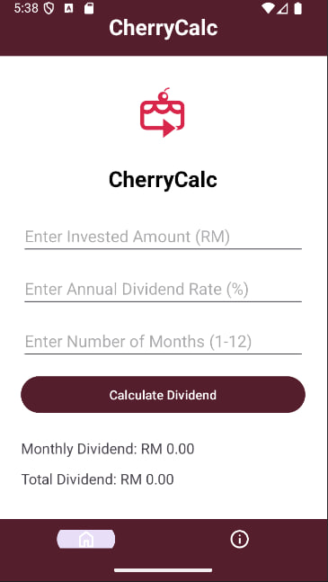

# 🍒 CherryCalc - Unit Trust Dividend Calculator

Android app that calculates monthly and total dividends from unit trust investments.

## Features
- Calculate dividends based on:
  - Invested amount
  - Annual rate (%)
  - Months (1-12)
- Clean Material Design UI
- About page with developer info

## Screenshots

  
  

